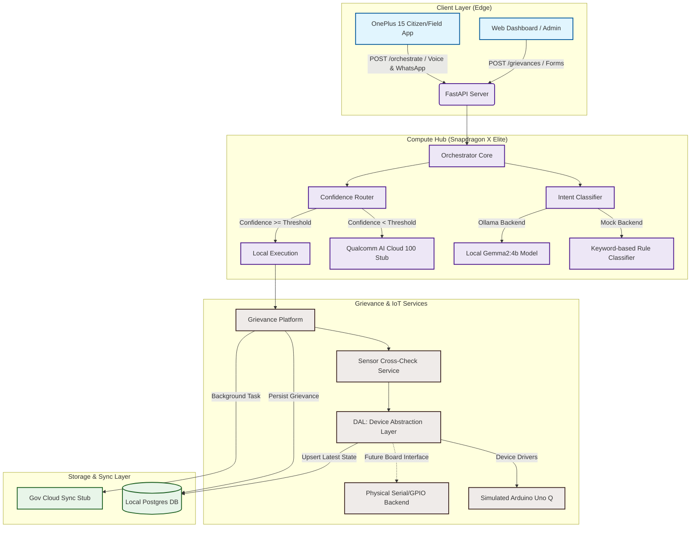

# Gram Seva AI — System Architecture & Project Analysis

Gram Seva AI is an **offline-first, voice-driven platform** tailored for Indian village government offices (Gram Panchayats). It is designed to run locally on a **Snapdragon X Elite AI PC (Copilot+)** as a central compute hub. By relying on local LLMs (Gemma2 via Ollama), local PostgreSQL, and a Device Abstraction Layer (DAL) interfacing with local hardware sensors (Arduino), it operates entirely without internet dependencies, while allowing optional cloud sync and escalation.

---

## 1. Core Architecture

The system is structured as a decoupled, multi-layered service in Python using FastAPI. It has four main components, coordinating via Pydantic schema boundaries and a shared local PostgreSQL database:

### Component Details
1. **Orchestrator Core (`/orchestrate`)**:
   - Accepts raw transcripts, language tags, and channel info.
   - Handed off to an **IntentClassifier** to identify the action (e.g., submitting a grievance, checking grievance status, registering farmer produce).
   - If classifier confidence is low, routes requests through the **Cloud Escalation Path** (stubbed for Qualcomm AI Cloud 100); otherwise, executes locally.
   
2. **Grievance Platform (`/grievances`)**:
   - Handles grievance submission (`POST`) and queries (`GET`).
   - Automatically resolves responsible departments via a config-driven YAML router ([routing.yaml](file:///c:/Users/qcwor/Downloads/Gram%20Seva%20AI/grievance/config/routing.yaml)).
   - Triggers sensor-based verification (for `streetlight` and `water` categories) against the physical state of village infrastructure.

3. **Device Abstraction Layer (DAL)**:
   - Provides a unified `read`/`write` interface ([interface.py](file:///c:/Users/qcwor/Downloads/Gram%20Seva%20AI/dal/interface.py)) for sensors.
   - Eliminates direct hardware dependency inside business logic.
   - Mirrors device readings asynchronously to a `device_state` database table, logging failures instead of blocking execution to safeguard offline resilience.

4. **Shared Database & Contracts**:
   - Postgres acts as the local system of record.
   - Pydantic models ([schemas.py](file:///c:/Users/qcwor/Downloads/Gram%20Seva%20AI/shared/schemas.py)) and Enums ([enums.py](file:///c:/Users/qcwor/Downloads/Gram%20Seva%20AI/shared/enums.py)) define strict interface boundaries between the voice pipeline, orchestrator, and database.

---

## 2. Key Offline-First Mechanics

- **Local Language Processing**: The environment uses a local Ollama instance serving `gemma2:4b` on the Snapdragon X Elite AI PC, ensuring low-latency NLP.
- **Fail-Safe Fallbacks**: If the Ollama server fails or times out, the system automatically falls back to a deterministic keyword-based rule classifier ([classifier.py](file:///c:/Users/qcwor/Downloads/Gram%20Seva%20AI/orchestrator/classifier.py)), guaranteeing zero system downtime.
- **Non-Blocking Sync**: Cloud database uploads and cloud model escalations are run via FastAPI's `BackgroundTasks`, so internet instability never delays local operations or database writes.
- **Resilient Device Writes**: DAL updates attempt database logging ([state_repo.py](file:///c:/Users/qcwor/Downloads/Gram%20Seva%20AI/dal/state_repo.py)) but swallow SQL exceptions gracefully, keeping the sensor read/write active even if the database is locked or rebooting.

---

## 3. Sensor Verification Heuristic

For `streetlight` and `water` grievances, a sensor crosscheck heuristic checks whether local systems are operational:
* **Streetlight**: Checks if `streetlight_status.on` is `True`.
* **Water**: Checks if `water_pump_status.on` is `True` and `flow_lpm` > 0.
* **Verdict**: 
  - If a citizen files a complaint and the sensor says it is active, the complaint is marked as **`disputed`** (needs manual audit, sensor says it works).
  - If the sensor says the device is inactive, it confirms the citizen's complaint and is marked as **`verified`** (immediate queueing for maintenance).

---

## 4. Current Dependencies

- **FastAPI / Uvicorn**: High-performance async web framework and ASGI server.
- **Pydantic**: Data validation and configuration based on Python type hints.
- **SQLAlchemy / Psycopg**: SQL toolkit and PostgreSQL database adapter.
- **PyYAML**: Parses the department routing configuration.
- **HTTPX**: Non-blocking HTTP client for Ollama LLM requests.
- **Pytest**: Offline testing suite.

---

## 5. Suggested Add-On Dependencies

To evolve Gram Seva AI into a robust production-ready platform, the following libraries are recommended:

| Dependency | Purpose | Benefit |
|---|---|---|
| **`pyserial`** | Physical Arduino Communication | Enables the DAL to communicate with actual Arduino Uno microcontrollers over USB serial instead of simulation. |
| **`faster-whisper`** | Local Speech-to-Text (STT) | Converts citizen voice notes directly to text on the Snapdragon PC without cloud services, boosting offline usability. |
| **`pyttsx3`** or **`coqui-tts`** | Local Text-to-Speech (TTS) | Synthesizes spoken audio output locally to read out status updates and eligibility checks to citizens in local languages. |
| **`alembic`** | Database Migrations | Manages PostgreSQL database schemas cleanly over time as new features are added. |
| **`celery` / `redis`** (or `arq`) | Robust Task Queueing | Replaces FastAPI `BackgroundTasks` with a durable queue, ensuring background cloud syncs survive system crashes or power failures. |
| **`pydantic-settings`** | Environment Configs | Clean, typed validation of `.env` configurations. |

---

## 6. Suggested Add-On Features

### A. Local Voice Processing Pipeline
Integrate local audio capture. Field agents or citizens upload an audio recording (e.g., in Hindi, Kannada, or English). A local model (like Whisper running via ONNX or ONNX Runtime optimized for Snapdragon CPU/NPU) transcribes the recording locally before feeding it into the orchestrator.

### B. Farmer Produce Module Implementation
Implement the reserved `farmer_produce` table and corresponding endpoints. This would allow farmers to voice-record their harvests (e.g., *"I harvested 15 quintals of ragi"*), extract the crop name, quantity, and unit using Gemma2, and persist it to the database for market (mandi) routing.

### C. Live Dashboard (Web PWA)
A lightweight React/Vite dashboard served from the Snapdragon hub over the local network (LAN). Panchayat officers can:
- View verified vs. disputed grievances.
- Monitor active/inactive streetlight and water pump sensor values in real-time.
- Manually change status (e.g., from `in_progress` to `resolved`).
- View analytics of complaints categorized by department.

### D. Automated WhatsApp / SMS Gateway
Configure a local gateway (e.g., running via a cellular dongle or a local Twilio agent that syncs opportunistically) to text citizens their grievance status updates (e.g., *"Your water pump complaint has been resolved by the Water Supply Department."*).

### E. Advanced NL Sensor Cross-Check
Enhance the simple active/inactive heuristic. An LLM-based check can analyze the text. For example, if a user complains *"The streetlight is too dim"* or *"The water pump is overflowing"* (which implies the pump is on, but malfunctioning), a simple active check might mistakenly mark it as `disputed`. An LLM cross-check would correctly mark it as `verified`.
